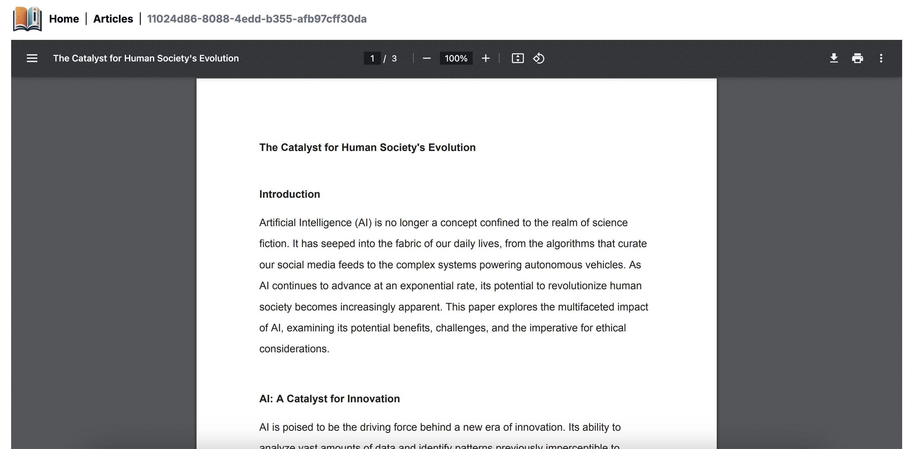

# AI-Powered E-Learning Platform

This project provides a self-learning platform that leverages artificial intelligence (AI) to create assessments, deliver personalized feedback, and empower users to gain knowledge at their own pace.

## Key Features

### Automatic Assessment Generation: 
Upon uploading an article, the system intelligently generates multiple-choice and written response questions to assess user comprehension of the content.

### Self-Directed Learning
 Users can visit the platform to explore a library of articles and delve into topics that suite their interest.

### Interactive Assessments: 
Users can readily access assessments associated with each article to test their understanding.

### Multiple Question Types:
Assessments incorporate both multiple-choice questions for quick knowledge checks and written response questions to encourage deeper understanding.

### AI-Powered Feedback: 
The system utilizes AI algorithms to automatically score multiple-choice questions and provide insightful feedback on written responses, helping users solidify their learning.


## Technologies Used

- Typescript: Used for core application development and AI model integration.
- NextJs: Provides a structure for building the web interface.
- ShadCn: The main UI library of the app.
- Langchain: Enables the creation and training of AI models for automated assessment generation and feedback.
- Google Gemini: Content and assessment creation
- Firestore: Stores assessments.
- Firebase storage: Store the artibles in pdf format

## Getting Started

First, run the development server:

```bash
npm run dev
# or
yarn dev
# or
pnpm dev
# or
bun dev
```

Open [http://localhost:3000](http://localhost:3000) with your browser to see the result.

Article selection


Read the article


Start assessment after reading


Assement - Multiple-choices questions


Assement - Written questions


Assement - result


Assement - feedback
