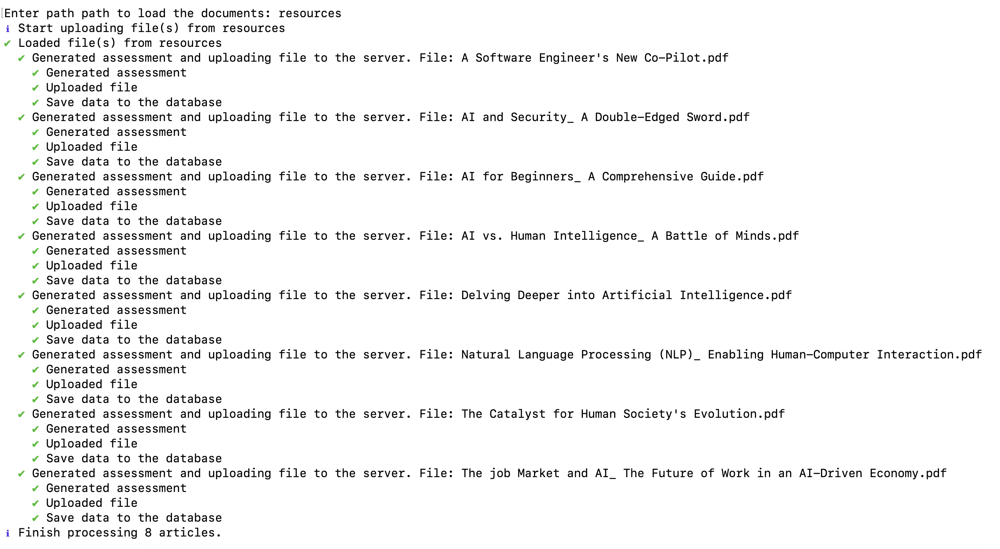

## Article Loader

### Overview
This Node.js application leverages Langchain and Google AI to process articles from a specified path. It generates assessments based on the article content, stores the assessments on Firestore, and uploads the original articles to Firebase for storage.

### Prerequisites
* Node.js and npm installed
* Google Cloud Platform project with Firebase, Firestore and Storage enabled https://console.firebase.google.com/
* Environment variables configured with the following keys can be found in .env.example

### Installation
1. Clone the repository:

2. Navigate to the project directory:
   ```bash
   cd article-loader
   ```

3. Install dependencies:
   ```bash
   npm install
   ```

### Configuration
1. Create a `.env` file in the article-loaders root and add the required environment variables.


### Usage
1. Run the application:
   ```bash
   npm start
   ```

### How it Works
1. **Load Articles:** The application iterates over the specified article path, reading each article as a pdf file.
2. **Generate Assessment:** For each article, Langchain is used to create an LLM chain. The chain processes the article content using the Google AI model to generate an assessment.
3. **Store Assessment:** The generated assessment is stored in the Firestore collection specified by the `FIRESTORE_COLLECTION` environment variable.
4. **Upload Article:** The original article is uploaded to Firebase storage using the provided API token and project ID.

### Dependencies
* Node.js
* Langchain
* Google Cloud Client Library
* Firebase Firestore
* Firebase storage
* Google AI

### Sample data
The sample files are available in the resources folder

### To upload the articles from the sample folders

   ```bash
   npm start
   ```
Then enter the path that stores the files

